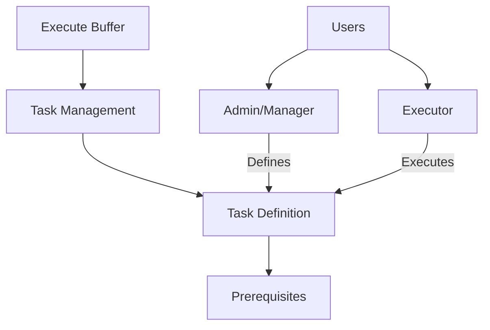

# Solid Execute Buffer

A robust smart contract for secure, verifiable computational task execution and management on the Stacks blockchain.

## Overview

Solid Execute Buffer provides a comprehensive framework for managing complex computational tasks with advanced execution tracking, prerequisite management, and verification mechanisms. This contract enables developers and organizations to create structured, secure task execution environments.

### Key Features
- Flexible task execution framework
- Advanced prerequisite management
- Granular task tracking and verification
- Secure multi-role access control
- Immutable task and execution records
- Scalable task management system

## Architecture

The Solid Execute Buffer is built around a core smart contract that manages computational tasks, their prerequisites, execution status, and user interactions.



### Core Components
- **Users**: Multiple roles with distinct permissions
- **Tasks**: Computational tasks with detailed metadata
- **Prerequisites**: Dependencies and execution requirements
- **Execution Tracking**: Comprehensive task status management
- **Verification**: Secure task completion validation

## Contract Documentation

### execute-buffer.clar
The primary contract managing computational task execution and tracking.

#### Key Maps
- `users`: User information and role management
- `tasks`: Task definitions and metadata
- `task-executions`: Execution tracking and verification
- `task-prerequisites`: Prerequisite management
- `user-relationships`: Access control and permissions

#### Access Control
- Role-based permissions
- Granular task management
- Secure execution verification

## Getting Started

### Prerequisites
- Clarinet
- Stacks blockchain wallet
- Clarity development environment

### Basic Usage

1. Register a user:
```clarity
(contract-call? .execute-buffer register-user "Jane Doe" u2) ;; Register as manager
```

2. Create a task:
```clarity
(contract-call? .execute-buffer create-task 
    "Data Processing" 
    "Large-scale data transformation" 
    "Data" 
    u3 
    u1 
    none)
```

3. Execute a task:
```clarity
(contract-call? .execute-buffer execute-task u1)
```

## Function Reference

### User Management
```clarity
(register-user (name (string-ascii 100)) (role uint))
```

### Task Management
```clarity
(create-task (title (string-ascii 100)) 
             (description (string-ascii 500))
             (category (string-ascii 50))
             (complexity uint)
             (task-group-id uint)
             (parent-task-id (optional uint)))

(execute-task (task-id uint))
(verify-task-execution (task-id uint) (executor principal))
```

## Development

### Testing
1. Clone the repository
2. Install Clarinet
3. Run `clarinet test`
4. Use `clarinet console` for interactive testing

### Local Development
1. Set up local Clarinet chain
2. Deploy contracts
3. Interact through console or API

## Security Considerations

### Permissions and Access Control
- Strict role-based access
- Granular task management permissions
- Immutable task and execution records

### Known Limitations
- Task prerequisites are immutable
- Execution verification requires manual steps
- Complex task dependencies require careful design

### Best Practices
- Define clear task hierarchies
- Implement comprehensive prerequisites
- Use role-based access strategically
- Maintain detailed execution evidence